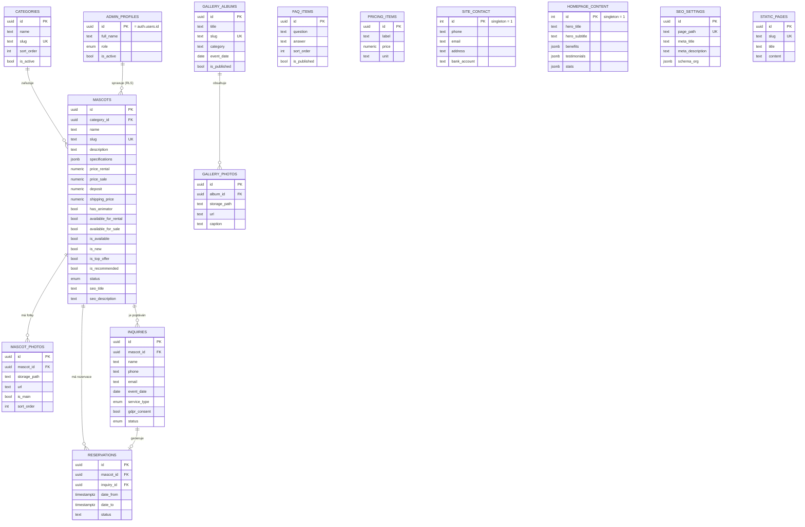

# ER diagram databáze — Maskoti Praha

## Poznámky k návrhu

- **`mascots`** je centrální entita; `specifications` je JSONB pro flexibilní klíč–hodnota údaje (výška, materiál…), aby šlo přidávat nové vlastnosti bez migrace schématu.
- **`mascot_photos`** má unikátní partial index zajišťující, že každý maskot má maximálně jednu `is_main = true` fotku.
- **`site_contact`** a **`homepage_content`** jsou tabulky typu *singleton* (vždy jeden řádek s `id = 1`) — zjednodušuje to čtení i editaci globálního obsahu.
- **`reservations`** obsahuje `EXCLUDE USING gist` omezení, které na úrovni databáze zabraňuje překryvu dvou rezervací pro stejného maskota — připraveno pro budoucí kalendář obsazenosti.
- Row Level Security (RLS) je zapnuté na všech tabulkách: veřejnost čte pouze publikovaný/aktivní obsah a smí vkládat poptávky; plný CRUD přístup mají pouze uživatelé v `admin_profiles` s `is_active = true`.
